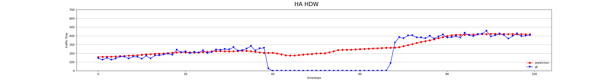
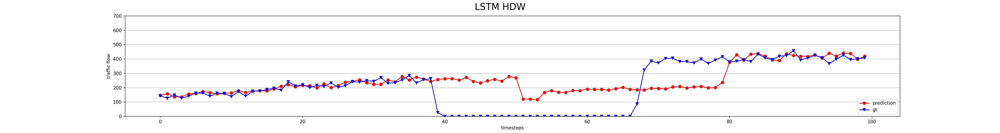
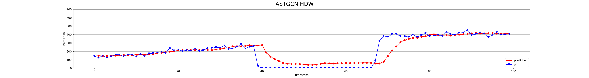

# Traffic flow forecasting

This is a fork project from [guoshnBJTU/ASTGCN-r-pytorch]('https://github.com/guoshnBJTU/ASTGCN-r-pytorch').


## Run

Notebook: [Google Colab]('https://colab.research.google.com/drive/12tZKt8vHd-hNZMHZYWY1x8iokuBH8C9e?usp=sharing')

- on PEMS04 dataset

  ```shell
  python prepareData.py --config configurations/PEMS04_[MODEL].conf
  ```

  ```shell
  python train_[MODEL]_r.py --config configurations/PEMS04_[MODEL].conf
  ```
## Prediction on sensor 1 in the first 100 step






## Contributing

- We modified the ASTGCN model with full three information from last hour, yesterday and previous week.
- We compare ASTGCN with GCN, LSTM, HA in various settings.
## Result

| Methods | HA (h/hdw)  | LSTM (h/hdw) | LSTMGC (h/hdw) | ASTGCN (h\/hdw) |
|---------|-------------|--------------|----------------|-----------------|
| MAE@1h  | 38.75/28.15 | 29.46/23.91  | 37.1/22.52     | **22.53/21.84**     |
